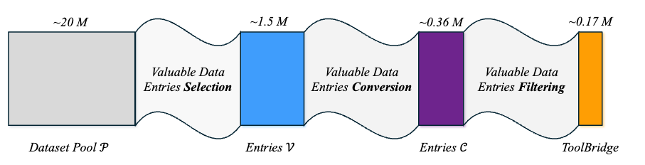
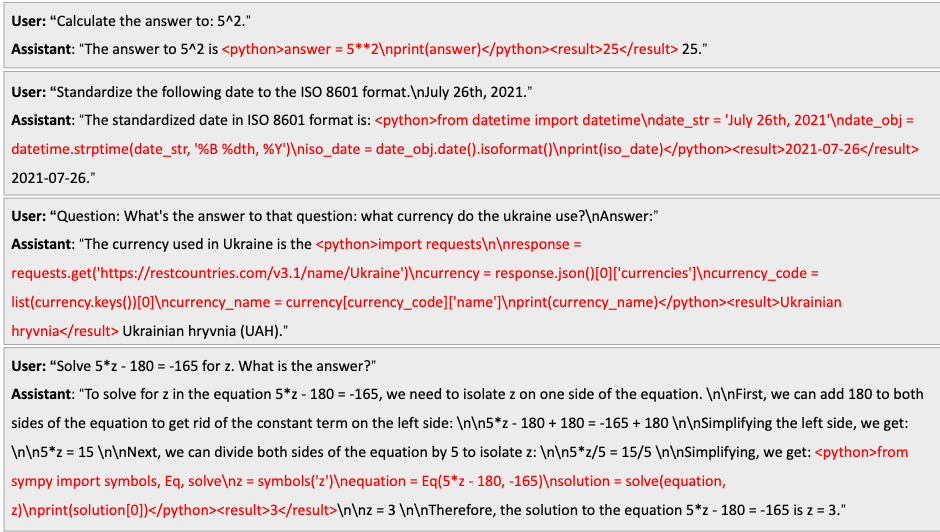

# ToolBridge: An Open-Source Dataset to Equip LLMs with External Tool Capabilities

Through the incorporation of external tools, large language models (LLMs), exemplified by GPT-4o and Llama 3.1, materially expand their functional capabilities, evolving from rudimentary dialogue systems to versatile general-purpose AI assistants. 
We propose that the foremost contributors to these advancements are the richness and heterogeneity of the training data. 
However, the existing LLMs with external tool integration provide only limited transparency pertaining to their datasets and data curation methodologies, motivating the initiation of this study. 
Specifically, this paper endeavors to present a detailed exposition of the methodology for constructing data entries that facilitate LLMs in effectively learning how to utilize external tools and disseminate this process to the public through the introduction of ToolBridge. 
ToolBridge seeks to harness a collection of open-source datasets as its raw dataset pool and then incorporates a series of strategies to determine appropriate data entries, upon which external tool insertions are executed. 
By supervised fine-tuning (SFT) on these curated entries, LLMs can develop proficiency in invoking external tools in appropriate contexts to improve their predictive accuracy, particularly for essential functions including numerical computation, data processing and factual retrieval. 
Our experiments rigorously isolate model architectures and training configurations, zeroing in exclusively on the role of data. 
The experimental results demonstrate that LLMs trained on ToolBridge consistently achieve superior performance across standard and custom evaluation datasets. 
To reinforce transparency, we will publicly release all associated code and data as open source, facilitating research on equipping LLMs with external tool capabilities.

#### Overview of Construction Pipeline



#### Data Examples from ToolBridge




# ToolBridge Construct Pipeline

Coming Soon


# Download Dataset

#### Download from HuggingFace

Load with Python,

```python
from datasets import load_dataset

dataset = load_dataset("BLWX/ToolBridge")
print(dataset['train'][0])
```

Then, you can see,

```python
{'original': {'messages': [{'role': 'user', 'content': '题目：\n鹿妈妈买了24个苹果，她想平均分给她的3只小鹿吃，每只小鹿可以分到几个苹果？'}, {'role': 'assistant', 'content': '鹿妈妈买了24个苹果，平均分给3只小鹿吃，那么每只小鹿可以分到的苹果数就是总苹果数除以小鹿的只数。\n24÷3=8\n每只小鹿可以分到8个苹果。所以，答案是每只小鹿可以分到8个苹果。'}]}, 'inserted': {'messages': [{'role': 'user', 'content': '题目：\n鹿妈妈买了24个苹果，她想平均分给她的3只小鹿吃，每只小鹿可以分到几个苹果？'}, {'role': 'assistant', 'content': '鹿妈妈买了24个苹果，平均分给3只小鹿吃，那么每只小鹿可以分到的苹果数就是总苹果数除以小鹿的只数。\n<python>total_apples = 24\nnum_deer = 3\napples_per_deer = total_apples // num_deer\nprint(apples_per_deer)</python>\n24÷3=8\n每只小鹿可以分到8个苹果。所以，答案是每只小鹿可以分到8个苹果。'}]}, 'insertedwithresults': {'messages': [{'role': 'user', 'content': '题目：\n鹿妈妈买了24个苹果，她想平均分给她的3只小鹿吃，每只小鹿可以分到几个苹果？'}, {'role': 'assistant', 'content': '鹿妈妈买了24个苹果，平均分给3只小鹿吃，那么每只小鹿可以分到的苹果数就是总苹果数除以小鹿的只数。\n<python>total_apples = 24\nnum_deer = 3\napples_per_deer = total_apples // num_deer\nprint(apples_per_deer)</python><result>8</result>\n24÷3=8\n每只小鹿可以分到8个苹果。所以，答案是每只小鹿可以分到8个苹果。'}]}}
```

where,

- original: Data entries from public sources.
- inserted: Data entries with special characters `<python>` and `</python>`.
- insertedwithresults: Data entries with special characters `<python>`, `</python>`, `<result>` and `</result>`.

#### Download from Github

Download ToolBridge datasets,

```sh
wget https://github.com/CharlesPikachu/ToolBridge/releases/download/datasets/toolbridge_178k.pkl
```

Load with Python,

```python
import pickle

data = pickle.load(open('toolbridge_178k.pkl', 'rb'))
print(data[0])
```

Then, you can see,

```python
{'original': {'messages': [{'role': 'user', 'content': '题目：\n鹿妈妈买了24个苹果，她想平均分给她的3只小鹿吃，每只小鹿可以分到几个苹果？'}, {'role': 'assistant', 'content': '鹿妈妈买了24个苹果，平均分给3只小鹿吃，那么每只小鹿可以分到的苹果数就是总苹果数除以小鹿的只数。\n24÷3=8\n每只小鹿可以分到8个苹果。所以，答案是每只小鹿可以分到8个苹果。'}]}, 'inserted': {'messages': [{'role': 'user', 'content': '题目：\n鹿妈妈买了24个苹果，她想平均分给她的3只小鹿吃，每只小鹿可以分到几个苹果？'}, {'role': 'assistant', 'content': '鹿妈妈买了24个苹果，平均分给3只小鹿吃，那么每只小鹿可以分到的苹果数就是总苹果数除以小鹿的只数。\n<python>total_apples = 24\nnum_deer = 3\napples_per_deer = total_apples // num_deer\nprint(apples_per_deer)</python>\n24÷3=8\n每只小鹿可以分到8个苹果。所以，答案是每只小鹿可以分到8个苹果。'}]}, 'insertedwithresults': {'messages': [{'role': 'user', 'content': '题目：\n鹿妈妈买了24个苹果，她想平均分给她的3只小鹿吃，每只小鹿可以分到几个苹果？'}, {'role': 'assistant', 'content': '鹿妈妈买了24个苹果，平均分给3只小鹿吃，那么每只小鹿可以分到的苹果数就是总苹果数除以小鹿的只数。\n<python>total_apples = 24\nnum_deer = 3\napples_per_deer = total_apples // num_deer\nprint(apples_per_deer)</python><result>8</result>\n24÷3=8\n每只小鹿可以分到8个苹果。所以，答案是每只小鹿可以分到8个苹果。'}]}}
```

where,

- original: Data entries from public sources.
- inserted: Data entries with special characters `<python>` and `</python>`.
- insertedwithresults: Data entries with special characters `<python>`, `</python>`, `<result>` and `</result>`.


# Citation

If you use ToolBridge in your research, please consider citing this project,

```latex
@article{jin2024toolbridge,
  title={ToolBridge: An Open-Source Dataset to Equip LLMs with External Tool Capabilities},
  author={Jin, Zhenchao and Liu, Mengchen and Chen, Dongdong and Zhu, Lingting and Li, Yunsheng and Yu, Lequan},
  journal={arXiv preprint arXiv:2410.10872},
  year={2024}
}
```